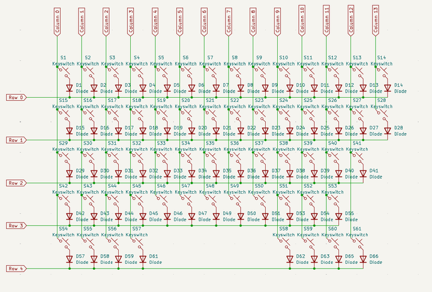
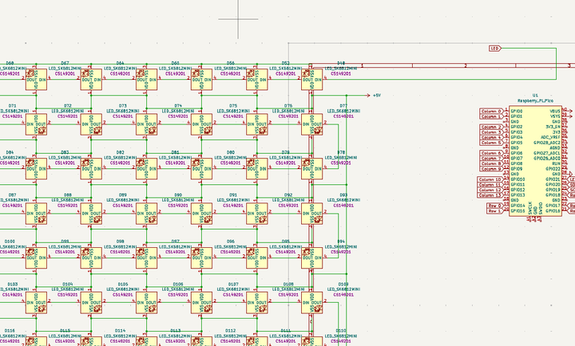
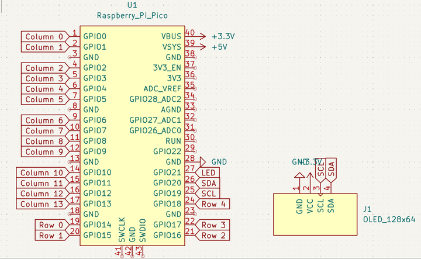
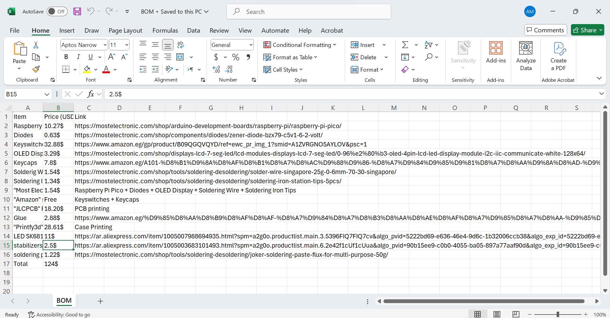

# Total Time: 9h 12m

### Day 1-Finished the schematic in 1h 30m 29/7/2025 4:30AM.
I made a new project on kicad, initialized the libraries (scottokeebs) in the paths, footprints and symbols, installed keyboard plugin and fabrication toolkit and started with making the schematic. I started making the schematic by adding the placeholder diodes and switches in rows and columns, wired them all and added the labels. then added a raspberry pi pico and connected all the labels to it. i also decided to add an OLED screen and some neopixels, so i added 61 leds sk6812mini and connected te circuit. and connected it to the ground and vcc. and finally added the oled screen with its labels (sda,scl) and connected it to the ground and voltage source too. then wired everything to the raspberry pi pico. and done! finished the schematic in 1.5 hours. 

### Day 2-Finished the PCB in 2h 30m 29/7/2025 2:00 PM.
after finishing the schematic, i saved everything and switched to the pcb editor, then updated the footprints from the schematic symbols. i used my keyboard layout (in .json format) on kle and uploaded it in the keyboard plugin so that it arranges the switches with diodes automatically. then manually arranged the neopixels over the switches. and finally added the raspberry pi pico on the top right and the OLED screen on the top middle. the routing step was the hardest, i routed everything several times until i had no critical errors. wired the switches with the diodes, the matrix of the keyboard all together (rows,columns). and finally routed the neopixels together and connected every footprint with its ground and voltage source to the pcb, i also connected all the labels to it (sda,scl,rows and columns). then finally finished everything after hard working. in 2.5 hours!

### Day 3-Finished the case and firmware in 5h 12m 30/7/2025 5:12 PM. 
after finishing the pcb routing, the cad design was pretty simple but required much time. i started with importing the json file of my layout to make the plate, then extruded it 1.5mm up and 3.5 down to make it stiff enough to prevent breaking. then cut 1 mm on each side of every switch hole so that the switches has a place to be holded on. and finally added the black plastic material to finish the plate. then i imported the step file of the pcb to check if the plate have the correct dimensions. and started to make the case. i started the case by making a sketch over the top side of the plate and made a 5mm thick frame around the plate. and extruded it 18mm down then made a quite sope so that my keyboard wouldn't be that flat. i also decided to add a smaller frame inside the case to hold the pcb too. so i made a sketch and extruded it 2.5 mm on each inner side of the case. then finally added the bottom part by making a sketch on a side of the case and extruded it about 290mm (the full length without the case thickness). and finally adde dthe holes and extruded the upper area of the case so that there's a space inside for the raspberry pi and the OLED screen. and done! everything is cool. finished it in about 5 hours.

and everything is done.
then i started to make the BOM for my components to see what they cost.

