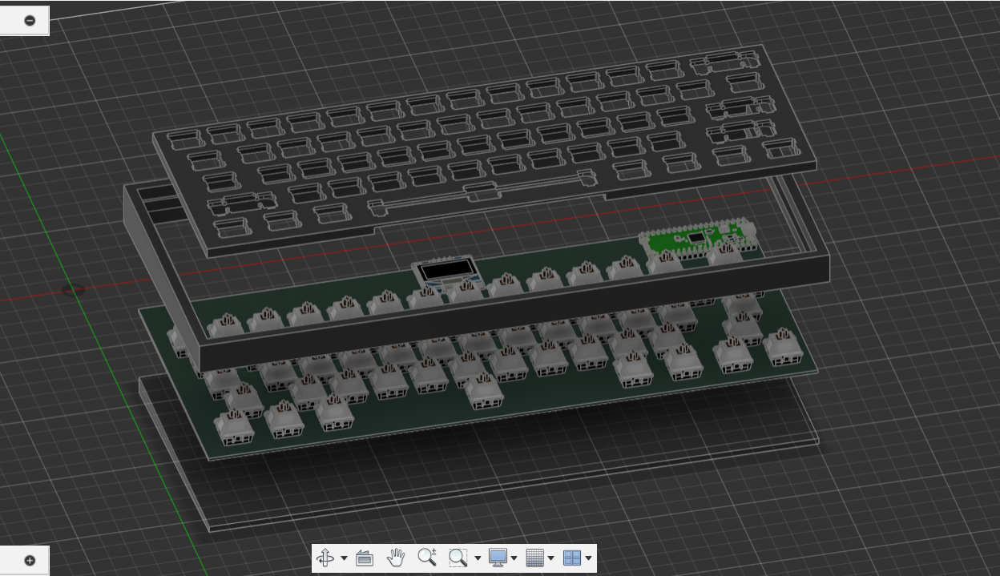

# Total Time: 9h 12m

### Day 1-Finished the schematic in 1h 30m 29/7/2025 4:30AM.
I made a new project on kicad, started with preparing the library (scottokeebs) then put the diodes and switches and put the label.
I found that putting some colors will make it a bit better so i added some sk6812 mini leds and an OLED 128x64 screen.
I used a raspberry pi to holed all of these labels, and done!

### Day 2-Finished the PCB in 2h 30m 29/7/2025 2:00 PM.
I arranged the switches with my layout using KLE plugin, then arranged the leds manually and finally put the screen on the top.
i struggled a little bit with routing but it's done anyway.

### Day 3-Finished the case and firmware in 5h 12m 30/7/2025 5:12 PM. 
I made the plate using a json file then edited it to fit the dimensions of the PCB, then made the case with some features like my name signed on the back. and made some holed for the oled screen and the raspberry pi socket. and finally finished it with adding the bottom part.

and everything is done.
