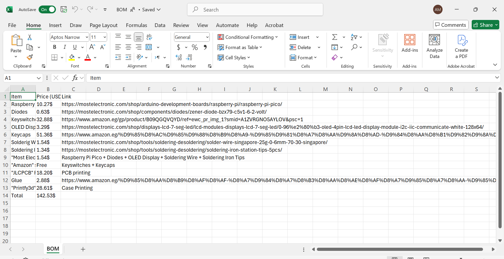

# Total Time: 9h 12m

### Day 1-Finished the schematic in 1h 30m 29/7/2025 4:30AM.
I made a new project on kicad, started with preparing the library (scottokeebs) then started making the matrix with diodes and switches. then wired the sk6812 LEDs anc connected them togheter with the power supply and the ground, added the oled screen then finally connected everything to the raspberry pi pico. it wasn't that hard so it took about 1.5 hours.

### Day 2-Finished the PCB in 2h 30m 29/7/2025 2:00 PM.
after finihing the schematic, i updated everything to the pcb. I arranged the switches with the diodes using KLE plugin then manually arranged the leds, rasp pico and the oled screen. then started routing everything. diodes with switches and leds with each other. and made the matrix too. wired the screen all to the raspberry pi pico. then finally made the edge cuts. this was pretty hard but finished it in 2.5 hours. 

### Day 3-Finished the case and firmware in 5h 12m 30/7/2025 5:12 PM. 
after finishing the pcb, I made the plate using a json file as a reference, then added the pcb to check the dimensions, made the plate with a 5mm thickness so that it will be stiff enough. after this i added the case and designed it all to avoid being too large or too small so that the pcb could get in there, and also made the holes for both the socket and the oled screen. then made some stands in the case to hold the pcb and make it stable, everything was made with a minimum thickness of 3mm and maximum of 5mm. and finally closed it with the bottom part. i added some custom features like my name signed behind and curved sides for the screen hole. and made a slope so that my keyboard will not be completely flat. and done!

and everything is done.
then i started to make the BOM for my components to see what they cost.

